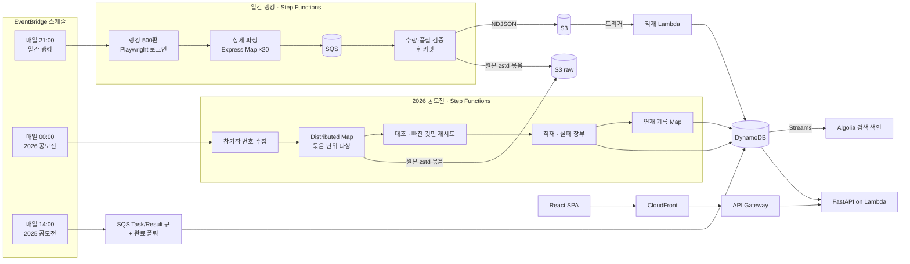

# NovelFlow

**웹소설 플랫폼 노벨피아의 랭킹을 매일 수집해 쌓고, 작품·태그·공모전의 흐름을 보여 주는 서버리스 데이터 파이프라인 + 웹 서비스**

[](https://d2ti06wylez2yq.cloudfront.net/)


[](LICENSE.md)

노벨피아는 실시간 랭킹은 보여 주지만 **어제와 비교한 변화, 한 작품의 추이, 태그의 유행**은 남기지 않습니다.
NovelFlow는 2024년 12월부터 매일 랭킹을 저장해 그 공백을 채웁니다.

| 지금까지 쌓은 것 (2026-10-08 기준) | |
|---|---|
| 일간 랭킹 | **651일** (2024-12-23 ~), 매일 상위 500편(2025-07 이전 300편) — 작품 스냅샷 약 28만 행(수집하지 못한 날 4일은 비워 둠) |
| 2025 공모전 | 참가작 4,719편 전수 × 371일 — 약 172만 행 |
| 2026 공모전 | 참가작 전수(개막 8일 만에 3,500편 이상) — 매일 자정 |
| 원본 HTML | 2026-09부터 데일리·2026 공모전이 받은 페이지를 압축 보관(데일리 편당 약 9KB) — 재수집 없이 과거를 다시 해석 |

---

## 무엇을 보여 주나

**지금 사이트에서**
- **일간 랭킹** — 순위·변동, 조회 대비 추천, 잔류율(1화 → 30화, 최신화 ← 30화 전), 태그 필터(`AND`·`OR`·`NOT`·괄호)
- **작품·작가 상세** — 기간별 순위·조회수·추천 추이, 작가의 작품 목록
- **태그** — 그날의 태그 랭킹과 기간 트렌드
- **2025 공모전** — 참가작 4,719편의 랭킹과 태그

**웹 개편 배포 뒤(`feat/webapp-redesign`, 데이터는 이미 쌓이는 중)**
- **2026 공모전** — 하루 동안 늘어난 조회수로 매기는 일간 순위, 기성/신인 구분
- **연재 기록** — 작품이 어느 날 회차를 올렸는지(실제 회차 목록 기준)와 연재 상태
- **태그 랭킹 개편** — 작품 수가 아니라 그날 랭킹 점수의 점유율로 순위, 100위 안 작품 수
- **분석 리포트** — 7·30·90일 동안 들어오고 빠진 작품, 순위 변동, 연재 페이스, 같은 순위대와 견주기
- **콘텐츠 정책** — 모든 표지 기본 흐림, 성인작 숨김 스위치

---

## 아키텍처



- **수집**: 일간 랭킹은 노벨피아에 로그인해 성인 모드를 켠 세션으로 받습니다. 공모전은 익명 세션으로 참가작 전수를 받습니다(2026 작가의 다른 작품 목록만 로그인 세션).
- **오케스트레이션**: Step Functions가 단계별 재시도·실패 격리·자동 재실행을 맡고, EventBridge가 일정을 잡습니다.
- **저장**: DynamoDB(조회용), S3(일별 NDJSON · 원본 HTML 묶음), Algolia(제목·작가 검색).
- **서빙**: CloudFront 뒤의 React SPA와 FastAPI(Lambda + Mangum). 90일 분석 같은 무거운 계산은 적재 때 만든 압축 스냅샷으로 합니다.

자세한 흐름·데이터 모델은 [docs/ARCHITECTURE.md](docs/ARCHITECTURE.md)에 있습니다.

---

## 설계에서 신경 쓴 것

이 프로젝트의 결정은 전부 [docs/DECISIONS.md](docs/DECISIONS.md)에 **이유와 실측 수치와 함께** 남아 있습니다(append-only, 60여 항목).
그중 데이터 엔지니어링 관점에서 핵심적인 것들입니다.

### 1. 실패를 가정한 파이프라인
- **결과가 아니라 결손을 기록한다.** 2026 공모전은 묶음 단위로 실패를 가두고(한 편 실패가 묶음 전체를 버리지 않게), 고정한 기대 목록과 대조해 **빠진 것만** 30초·120초 뒤 다시 받습니다. 끝내 못 받은 작품은 사유를 단 자리표시와 실패 장부(`failures/{date}.json`)로 남깁니다.
- **품질 기준은 실측으로 정한다.** 커밋된 651일의 자리표시를 전수 조사했더니 대부분이 '200인데 31KB에서 잘린 응답'이었고 전부 다음 날 멀쩡했습니다. 그래서 쓸 수 없는 페이지는 그 자리에서 다시 받고, 품질 게이트는 정상일 최대(0.8%)와 가장 작은 장애(63%) 사이의 **2%**로 다시 잡았습니다.
- **수량이 맞아도 내용이 틀릴 수 있다.** 로그인이 풀리면 랭킹은 여전히 500편이지만 성인작 26%가 다른 작품으로 바뀝니다. 그래서 건수뿐 아니라 남은 자리표시 비율·누적 조회수 감소·성인작 0편(로그인 풀림 신호)을 함께 보고, 공모전은 하루 사이 새로 접근 불가가 된 작품 수도 봅니다.

### 2. 하루의 값은 그 시각의 값
- 일간 순위는 '전날 대비 증가'라 늦게 받은 값은 다른 날의 값입니다. 그래서 **늦은 재실행은 거절**하고(일간 22:00, 2026 공모전 D+1 01:00), 자동 재실행은 마감 안에서 한 번만 합니다. 예약 실행이 중복 전달돼도 **날짜 잠금**으로 한 번만 돕니다.
- SQS purge는 최대 60초 동안 새 메시지까지 지울 수 있어 실제로 작업 599건을 잃은 적이 있습니다 — purge 뒤 **65초 대기**를 상태 머신에 둡니다.

### 3. ETL에서 ELT로
- 파싱 결과만 남기면 규칙이 바뀌었을 때 과거를 다시 얻을 수 없습니다. 받은 HTML을 **스크립트까지 그대로**(비밀값만 치환) 남기고, 소급은 재크롤링 대신 `scripts/reparse_raw.py`로 합니다.
- 압축은 **하루치를 묶어 zstd**로 — gzip은 윈도가 32KB라 묶어도 이득이 없었습니다(편당 91KB → 9KB, S3 PUT 500회 → 1회).

### 4. 판정은 적재 때 굳히지 않는다
- 성인작 여부·기성/신인은 판정 결과를 적재 때 굳히지 않고 근거(등급 배지, 작가의 다른 작품 목록 원문)만 저장해 **백엔드 한 곳에서** 판정합니다(웹 개편과 함께 배포). 기준이 바뀌거나 차단 목록이 갱신돼도 과거 데이터에 그대로 반영됩니다.
- 실제로 공모전 작가 정보를 익명으로 받으면 19금 작품이 통째로 빠져, 다시 받아 보니 기성 작가 119명이 신인으로 보이고 있었습니다 — 근거만 고쳐 받아 모든 날짜에 소급했습니다.

### 5. 지표는 근거가 있어야 한다
- 잔류율의 30화·1화 기준은 노벨피아의 무료분(15화)과 정액제 구조에서 나왔습니다. 커뮤니티 관행 지표로 바꾸면 회차 수 편향의 방향만 뒤집힌다는 것을 실측했습니다(+0.70 → −0.64).
- 태그 순위는 '몇 편에 달렸나'가 아니라 그날 **랭킹 점수의 점유율**로 매깁니다 — 1위와 99위가 같은 무게가 되지 않게(웹 개편 배포 후).

---

## 기술 스택

| 분류 | 기술 |
|---|---|
| 수집 | Python 3.13, Requests, BeautifulSoup, Playwright(로그인) |
| 오케스트레이션 | AWS Step Functions(Standard · Express · Distributed Map), EventBridge Scheduler, SQS |
| 컴퓨팅 | AWS Lambda(zip · 컨테이너 이미지), Amazon ECR |
| 저장 | DynamoDB(+Streams), S3, SSM Parameter Store, Algolia |
| 운영 | CloudWatch 알람, Discord 알림 Lambda, 실패 장부 |
| 웹 | FastAPI + Mangum(Lambda), API Gateway, React + TypeScript + Vite, Recharts, CloudFront |

---

## 저장소 구조

```
NovelFlow/
├── crawler/                 일간 랭킹 크롤러(랭킹·상세 Lambda, consolidate) + 상태 머신 정의
├── contests/
│   ├── 2025/                2025 공모전: 참가작 ID 수집기, SQS 기반 파서·적재
│   └── 2026/                2026 공모전: Distributed Map 파이프라인, deploy.sh
├── data-pipeline/           S3 → DynamoDB 적재, 태그 통계, Algolia 동기화
├── scripts/                 소급·재파싱·측정 스크립트(--dry-run 먼저)
├── utils/                   Discord 알림, Lambda 웜업
├── webapp/
│   ├── backend/api/         FastAPI 엔드포인트(Mangum으로 Lambda 실행)
│   └── frontend/            React + TypeScript SPA
└── docs/                    ARCHITECTURE · DECISIONS · OPERATIONS
```

---

## 로컬에서 실행하기

준비물: Python 3.13, Node.js. 웹은 실제 DynamoDB를 읽으므로 AWS 자격증명(리전 `ap-northeast-2`)이 필요합니다.

```bash
# 백엔드 — http://localhost:8000
cd webapp/backend && pip install -r requirements.txt && cp .env.example .env && python api/main.py

# 프론트엔드 — http://localhost:5173
cd webapp/frontend && cp .env.example .env && npm install && npm run dev
```

파이프라인 테스트(폴더마다 `requirements.txt` 설치 후)

```bash
for d in crawler data-pipeline scripts contests/2025/contest_detail_parser \
         contests/2026/contest_detail_parser contests/2026/contest_id_collector; do
  (cd $d && python -m unittest discover -p 'test_*.py')
done
bash scripts/check_copies.sh     # 이미지마다 복사해 둔 공용 모듈(raw_store 등)이 같은지
```

배포는 컴포넌트마다 다릅니다(컨테이너 이미지 · zip · `contests/2026/deploy.sh`) — [docs/OPERATIONS.md](docs/OPERATIONS.md)를 보세요.

---

## 문서

| 문서 | 내용 |
|---|---|
| [ARCHITECTURE.md](docs/ARCHITECTURE.md) | 파이프라인별 흐름, 원본 HTML 레이어, DynamoDB 데이터 모델 |
| [DECISIONS.md](docs/DECISIONS.md) | "왜 이렇게 했는가" — 결정·이유·실측·바뀐 이력 |
| [OPERATIONS.md](docs/OPERATIONS.md) | 배포 절차, 알람, 운영 점검 |
| [CLAUDE.md](CLAUDE.md) | 기여자·코딩 에이전트용 안내(바꾸기 전에 확인할 의도된 설계) |

---

## 데이터와 권리

수집 대상은 노벨피아에 공개된 랭킹·작품 정보입니다. 작품 제목·줄거리·표지·태그의 권리는 노벨피아와 각 작가에게 있으며 코드 라이선스에 포함되지 않습니다.
웹 개편부터는 성인작을 숨길 수 있게 백엔드 한 곳에서 판정하고, 모든 표지를 기본으로 흐리게 표시합니다.

## License

코드는 [MIT License](LICENSE.md)를 따릅니다.
